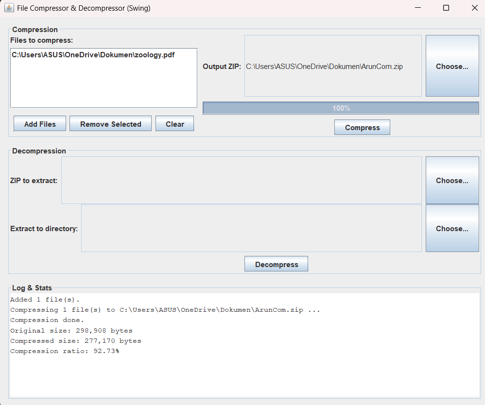
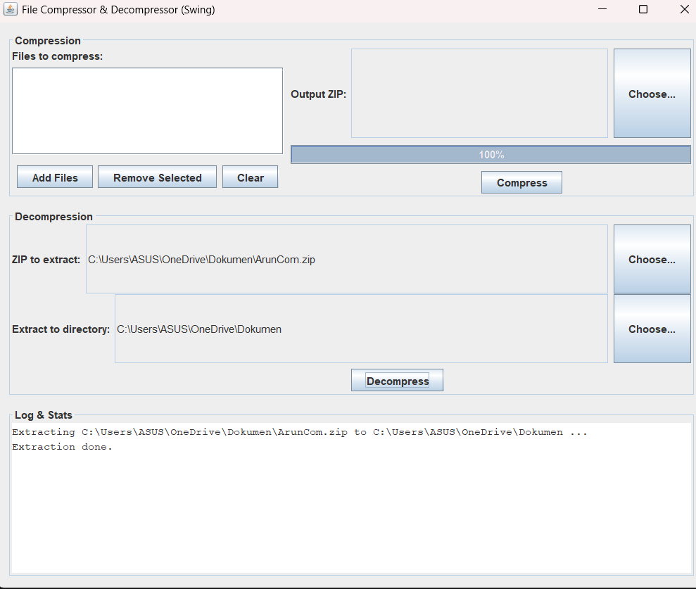

# 📦 File Compressor & Decompressor

## 🔹 Overview
The **File Compressor and Decompressor** is a desktop application built in **Java (Swing)** that allows users to:
- Compress multiple files into a single `.zip` archive.
- Decompress existing `.zip` archives back into their original files.
- Track progress of compression and decompression operations.
- View compression statistics (original size, compressed size, compression ratio).

This project demonstrates practical usage of **Java I/O**, **Streams**, and the `java.util.zip` package along with a simple **GUI**.

---

## 🔹 Features
- ✅ Multiple file compression into one ZIP.  
- ✅ One-click decompression of ZIP files.  
- ✅ Progress bar for large files.  
- ✅ Compression statistics logging.  
- ✅ User-friendly Swing interface.  
- ✅ Packaged as a runnable JAR file.  

---

## 🔹 Tools & Technologies
- **Language**: Java (JDK 17 or later)  
- **GUI Framework**: Swing  
- **Library**: `java.util.zip`  
- **IDE**: Visual Studio Code / IntelliJ / Eclipse  

---

## 🔹 Project Structure
FileCompressor/
 └── src/
     └── com/
         └── example/
             └── compressor/
                 ├── Main.java
                 ├── Compressor.java
                 ├── Decompressor.java
                 └── CompressionStats.java
## 🔹 Screenshots

### Compression Window

### Decompression Window

